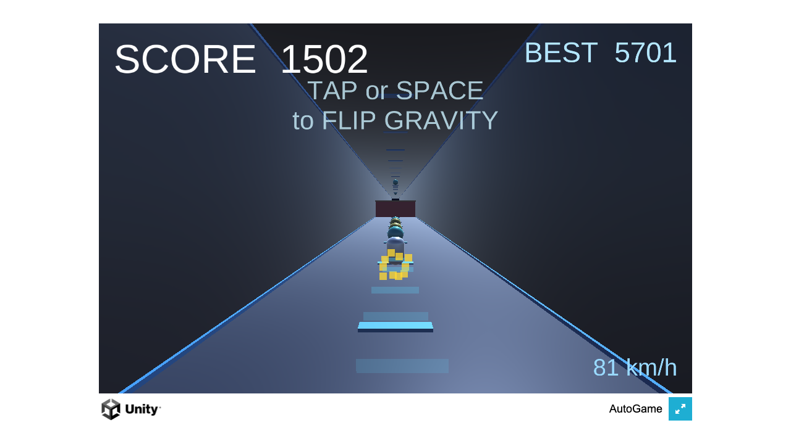

# 🌀 Gravity Dash

> ワンタップで重力を反転させて駆け抜けるネオンランナー

ネオンの回廊をダッシュしながら、床と天井を切り替えてハザードバーを回避するワンタップアクションゲームです。オーブを集めてコンボを繋ぎます。Unity で制作され、ブラウザ上でプレイできます。


🔗 **[Live Demo](https://masafykun.github.io/gravity-dash/)**

---

## 📸 スクリーンショット



---

## 🎮 操作方法

| 操作 | 動作 |
|---|---|
| タップ / クリック | 重力を反転し、床と天井を切り替える |

---

## ✨ 特徴

- **ワンタップ操作** — タップだけで床と天井を切り替えるシンプルな操作性
- **ハザード回避** — 流れてくるハザードバーを重力反転でかわす
- **コンボシステム** — オーブを集めてコンボを繋ぐ
- **ブラウザプレイ** — WebGL ビルドにより GitHub Pages から直接プレイ可能

---

## 🛠️ 技術スタック

| カテゴリ | 技術 |
|---|---|
| ゲームエンジン | Unity 6000.0.77f1 |
| 言語 | C# |
| ビルド | WebGL |
| ホスティング | GitHub Pages |

---

## 🚀 セットアップ

```bash
# WebGL ビルド済みのため、ブラウザで直接プレイできます
# Live Demo: https://masafykun.github.io/gravity-dash/

# C# ソースは src/ 以下にあります
# Unity 6000.0.77f1 でプロジェクトを開いて編集・ビルドが可能です
```

---

---

## ライセンス

[](https://opensource.org/licenses/MIT)

このプロジェクトは **MIT ライセンス** のもとで公開しています。

© 2026 masafykun (https://github.com/masafykun)
